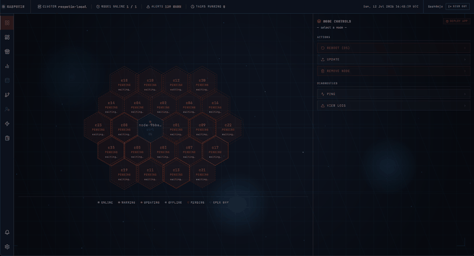
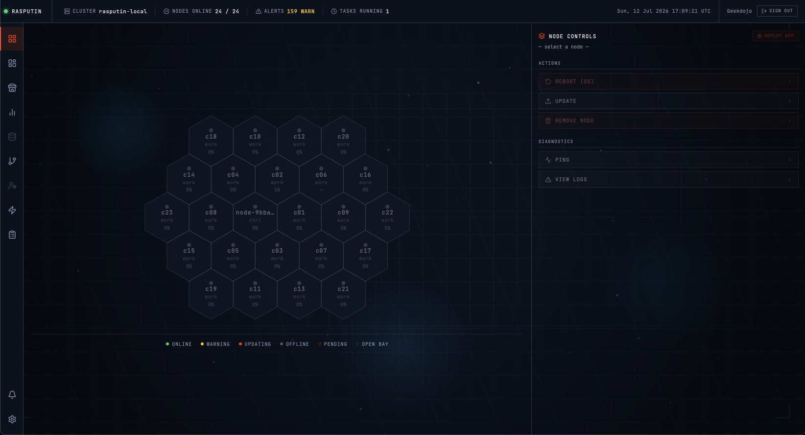
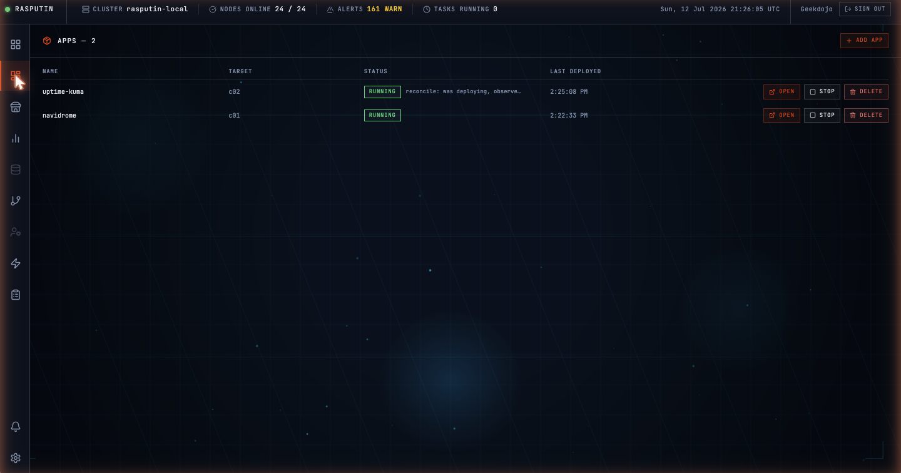
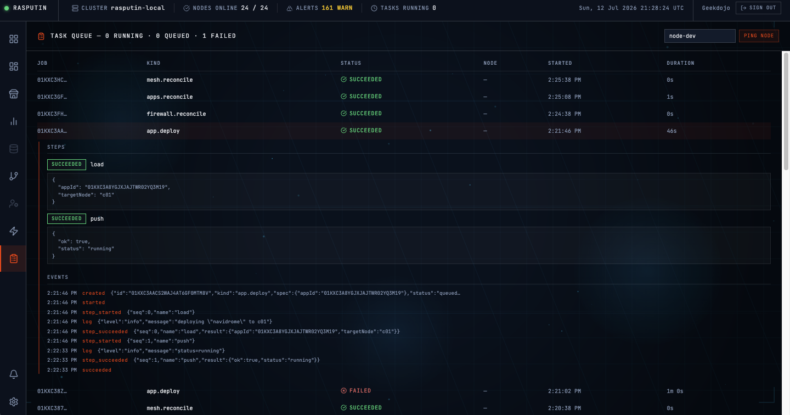

# rasputin-control-plane

[](https://github.com/geekdojo/rasputin-control-plane/actions/workflows/ci.yml)
[](https://github.com/geekdojo/rasputin-control-plane/releases)
[](LICENSE)

The brain of **Rasputin** — an open-source homelab cluster system: a small
fleet of nodes (Raspberry Pi or Intel N100) plus a dedicated firewall node,
managed from one web UI. Atomic A/B OS updates with automatic rollback,
passkey-only auth, Docker Compose apps behind a catalog — opinionated where
you want guidance, open where you want control, and built to work in the
first hour.

> **Want to run Rasputin, not build it?** Flashable images and a four-step
> quickstart live at
> [rasputin.geekdojo.com/download](https://rasputin.geekdojo.com/download/).

This monorepo holds the control plane: API, web UI, and node agent (system
overview: [ARCHITECTURE.md](ARCHITECTURE.md)). The bootable images live in
[`rasputin-os`](https://github.com/geekdojo/rasputin-os) (compute/controlplane
nodes) and
[`rasputin-openwrt-firewall`](https://github.com/geekdojo/rasputin-openwrt-firewall)
(firewall node).

> **Status: pre-alpha.** Rasputin is in its commodity-hardware proof phase.
> APIs, wire formats, and schemas change without notice. Nothing here is
> ready to protect a network you care about — yet.

**Start with [ARCHITECTURE.md](ARCHITECTURE.md)** for the system-level
picture: node roles, the bus, the job model, updates, the firewall, mesh,
and observability.

## Screenshots

A 24-node BitScope rack enrolling and coming online — 23 Pi 4 compute nodes
plus an off-rack Pi 5 control plane, power-on to 24/24 in 121 seconds:



The dashboard — the same cluster, all green:



Apps are Docker Compose stacks deployed from the catalog to a node you pick:



Every state-changing action is a Job — expand one and you get its steps and
the full event stream, replayable after the fact:



## What's in here

- `api/` — `rasputin-api`, the Go backend. Embeds NATS + JetStream and
  SQLite, and serves the built web UI. The only thing that mutates system
  state, and only via the universal Job model — every state-changing action
  is a visible, replayable Job.
- `agent/` — `rasputin-agent`, the Go binary that runs on every node
  (including the control plane node itself). Dials NATS outbound-only,
  executes commands (Docker Compose, OS updates, firewall config via
  ubus/UCI), emits events and heartbeats.
- `proto/` — Wire schemas shared between `api` and `agent`.
- `ui/` — Next.js (App Router, TypeScript) frontend. Ships as a static
  export served by the api on one origin; see `ui/README.md`.
- `deploy/` — systemd units, update-bundle recipes, sidecar compose files
  (VictoriaMetrics, Loki, Grafana, Headscale).
- `docs/` — Repo-local engineering notes.

Key properties, honestly stated:

- **Single-binary control plane.** No external broker, no Postgres, no
  Redis, no reverse proxy. SQLite + embedded NATS.
- **Outbound-only agents** with join tokens bound to a node id — a
  compromised node can't impersonate another.
- **Atomic A/B OS updates** with health-check rollback, driven end-to-end by
  a saga you can watch in the Tasks panel.
- **WebAuthn/passkey auth only.** No passwords.
- **Not Kubernetes.** The app primitive is Docker Compose behind a catalog
  UI. (k3s/Incus advanced modes are roadmap, not shipped.)

## Build

```sh
# Go side (api + agent share go.work).
# Name the modules explicitly — `./...` from the workspace root doesn't
# expand into workspace submodules when the root itself isn't a module.
go build ./api/... ./agent/...

# UI (dev server on :3000, dialing the api on :8080)
cd ui && npm install && npm run dev
```

Run the api locally with `go run ./cmd/rasputin-api` from `api/`. See
`ui/README.md` for a production-shaped local run (static export served by
the api).

## Releases

The OS-image pipelines vendor pre-built `rasputin-agent` and `rasputin-api`
binaries from this repo's GitHub Releases. They're pure Go
(`modernc.org/sqlite`, embedded NATS — no cgo), so `CGO_ENABLED=0` yields
fully static, libc-independent binaries: the same `linux-amd64` agent runs
on the Buildroot OS *and* on the OpenWrt firewall (no separate musl build).
The api tarball bundles the built web UI, so api + UI version together.

```sh
# build locally (dist/ is gitignored)
scripts/build-release.sh 0.1.0
# → dist/rasputin-{agent,api}-<version>-linux-{amd64,arm64}.tar.gz (+ .sha256, + .hash)
```

CI (`.github/workflows/release.yml`) runs the same script on a version tag —
or as a manually dispatched dev prerelease — and attaches tarballs +
checksums to a GitHub Release. The image repos fetch them by pinned version
and hash.

## Contributing

Issues and discussion are welcome — see [CONTRIBUTING.md](CONTRIBUTING.md)
for the PR flow and the CLA (signing is automatic on your first PR).

## AI-assisted development

This project is developed by a human maintainer working with AI coding assistants;
AI-assisted commits carry `Co-Authored-By` trailers naming the model. Approach,
accountability, and provenance: [AI_DISCLOSURE.md](AI_DISCLOSURE.md).

## License

[AGPL-3.0](LICENSE).
